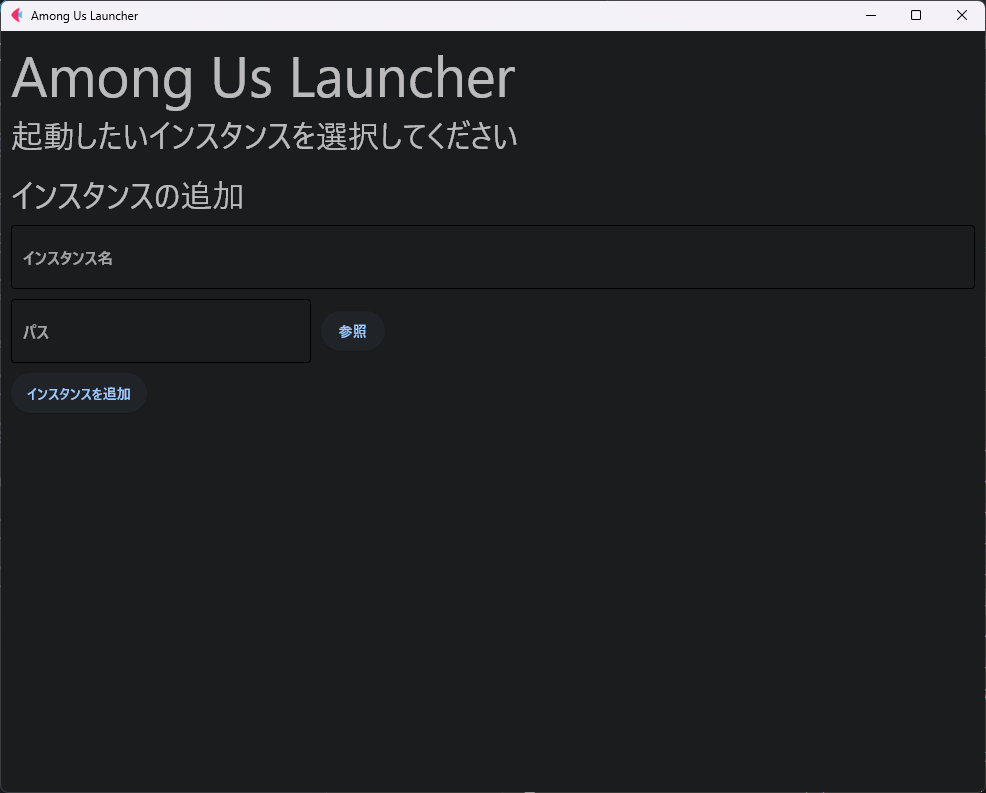

# Among Us Launcher



## Download
[Release](https://github.com/nattyan_tv/amongus_launcher/releases/latest)からダウンロードしてください。

使い方は[こちら](https://qiita.com/nattyan_tv/items/c303a88dd27b4c54696c)

Steam版でも大体動くんじゃないんかなって思うけどEpicGameLauncher版を想定して作ってます。

## Develop
`requirements.txt`をインストールしてください。  
その際、`venv`などで仮想環境を作ることをお勧めします。  
また、ビルドをする場合は`pyinstaller`を別でインストールしてください。

### VENV
#### Activate
```ps
.venv\Scripts\activate
```

#### Deactivate
```ps
deactivate
```

